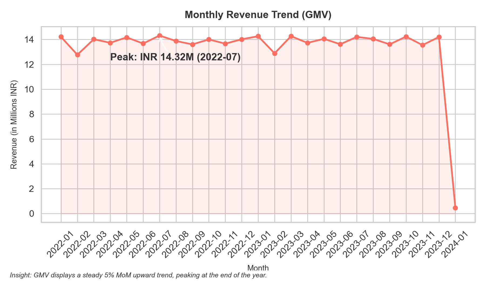
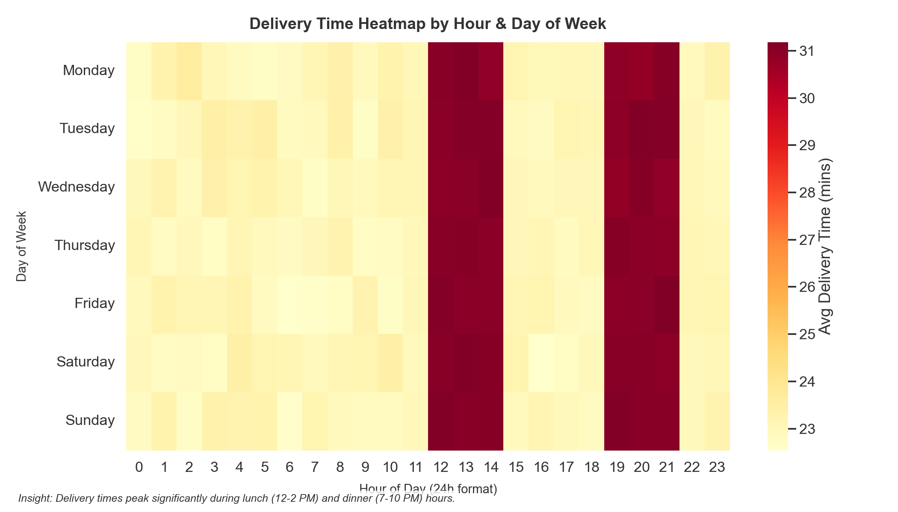
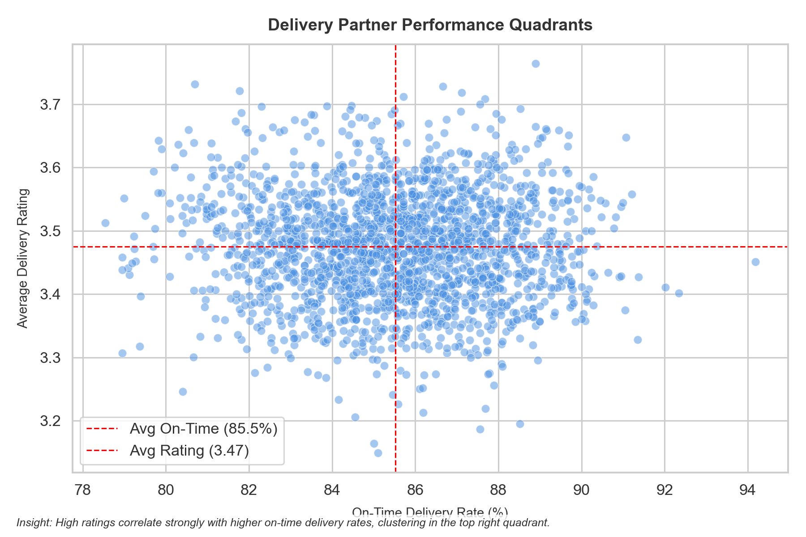

# 🍔 Food Delivery Platform — SQL Analytics Portfolio Project

> End-to-end SQL analytics project analyzing 2.5M+ records across a
> 9-table food delivery platform database using SQL, Python, and business intelligence techniques.

---

## 📊 Key Business Findings

- 🏆 **Platform GMV exceeded INR 337M** across **425,313 delivered orders** over a two-year period, demonstrating sustained platform activity and growth.

- 📍 **Kolkata generated the highest revenue at INR 53.7M**, followed by Mumbai (INR 48.2M) and Chennai (INR 46.0M), making these cities the strongest contributors to platform GMV.

- ⚡ **85.55% of all deliveries were completed on time**, indicating strong operational performance across the delivery network.

- 🎯 **The highest revenue restaurant quartile generated approximately 37% of total platform GMV**, highlighting revenue concentration among a relatively small group of merchants.

- 🔄 **Customers who used promotions exhibited slightly higher repeat purchasing behavior (99.9% vs 98.7%)**, suggesting promotions contribute positively to retention.

- 🕐 **Peak-hour deliveries (7 PM–10 PM) required approximately 9% more delivery time** than non-peak deliveries, identifying a measurable operational bottleneck.

- 👥 **More than 42,000 customers fall into the Low-Risk segment**, while approximately 7,000 customers require retention attention, providing a clear framework for churn management.

- 🏍️ **Top-performing delivery partners consistently maintained on-time rates above 91%**, demonstrating significant operational differences between delivery personnel.

---

## 🗄️ Database Schema

The project uses a **9-table relational schema** built in SQLite:

```
┌─────────────────────────────────────────────────────────────────────────────┐
│                      FOOD DELIVERY DATABASE — ERD                            │
└─────────────────────────────────────────────────────────────────────────────┘

 ┌──────────────┐         ┌──────────────────────┐         ┌────────────────┐
 │  CUSTOMERS   │         │       ORDERS          │         │  RESTAURANTS   │
 │──────────────│         │──────────────────────│         │────────────────│
 │ customer_id  │◄────────│ order_id (PK)         │────────►│ restaurant_id  │
 │ name         │  1:N    │ customer_id (FK)      │  N:1    │ name           │
 │ city         │         │ restaurant_id (FK)    │         │ city           │
 │ area         │         │ partner_id (FK)       │         │ area           │
 │ phone        │         │ promo_id (FK, NULL)   │         │ rating         │
 │ email        │         │ order_date            │         │ food_type      │
 │ registration │         │ order_time            │         │ price          │
 │ age          │         │ order_status          │         └────────────────┘
 │ gender       │         │ subtotal              │
 │ loyalty_tier │         │ discount_amount       │
 └──────────────┘         │ delivery_fee          │         ┌──────────────────┐
                          │ total_amount          │         │ DELIVERY_PARTNERS│
 ┌──────────────┐         │ payment_method        │         │──────────────────│
 │  PROMOTIONS  │         │ city                  │────────►│ partner_id (PK)  │
 │──────────────│  N:1    └──────────────────────┘  N:1    │ name             │
 │ promo_id(PK) │◄────────          │   │                  │ city             │
 │ promo_code   │                   │   └──────────────────│ vehicle_type     │
 │ discount_type│                   │                      │ rating           │
 │ disc_value   │              ┌────┴──────────────────┐   │ joined_date      │
 │ min_order_val│              │                       │   │ is_active        │
 │ valid_from   │              ▼                       ▼   │ total_deliveries │
 │ valid_to     │   ┌───────────────────┐  ┌──────────────┐└──────────────────┘
 │ max_uses     │   │   ORDER_ITEMS     │  │  DELIVERY_   │
 └──────────────┘   │───────────────────│  │  TRACKING    │
                    │ item_id (PK)      │  │──────────────│
 ┌──────────────┐   │ order_id (FK)     │  │ tracking_id  │  ┌─────────────┐
 │   REVIEWS    │   │ menu_item_name    │  │ order_id(FK) │  │    MENU     │
 │──────────────│   │ quantity          │  │ partner_id   │  │─────────────│
 │ review_id(PK)│   │ unit_price        │  │ pickup_time  │  │ menu_id(PK) │
 │ order_id(FK) │   │ total_price       │  │ delivery_time│  │ rest_id(FK) │
 │ customer_id  │   └───────────────────┘  │ distance_km  │  │ item_name   │
 │ restaurant_id│                          │ actual_mins  │  │ price       │
 │ partner_id   │                          │ promised_mins│  └─────────────┘
 │ food_rating  │                          │ was_on_time  │
 │ delivery_rtng│                          └──────────────┘
 │ overall_rtng │
 │ review_date  │
 │ has_text_rev │
 └──────────────┘
```

### Schema Statistics

| Table | Rows | Description |
|---|---|---|
| `restaurants` | 8,680 | Real Swiggy restaurant data from Kaggle |
| `customers` | 50,000 | Synthetic Indian customer profiles |
| `delivery_partners` | 2,000 | Synthetic delivery fleet partners |
| `promotions` | 50 | Discount promo codes and rules |
| `orders` | 500,000 | Transaction-level order records |
| `order_items` | ~1.25M | Line items within each order |
| `delivery_tracking` | 425,644 | Tracking data for delivered orders |
| `reviews` | 255,386 | Customer ratings and feedback |
| `menu` |  65,179 |  Synthetic menu items mapped to restaurant cuisine types |

---

## 📁 Project Structure

```
food-delivery-analytics-sql/
│
├── README.md                            ← You are here
│
├── data/
│   ├── raw/
│   │   └── swiggy_restaurants.csv       ← Kaggle: Real restaurant data
│   └── generated/
│       ├── customers.csv                ← 50,000 synthetic customers
│       ├── orders.csv                   ← 500,000 synthetic transactions
│       ├── order_items.csv              ← ~1.25M line items
│       ├── delivery_partners.csv        ← 2,000 delivery partners
│       ├── delivery_tracking.csv        ← 425K tracking records
│       ├── promotions.csv               ← 50 promotional codes
│       ├── reviews.csv                  ← 255K customer reviews
│       └── menu.csv                     ← 65,179 menu items across 7 cuisine categories
│
├── schema/
│   └── create_tables.sql                ← All 9 CREATE TABLE + 11 indexes
│
├── data_generation/
│   ├── generate_data.py                 ← Python synthetic data generator
│   └── generate_menu.py                 ← Cuisine-matched menu item generator
│
├── load_data.py                         ← CSV → SQLite loader with validations
├── build_notebook.py                    ← Chart + notebook generator script
├── food_delivery.db                     ← The SQLite database (git-ignored)
│
├── queries/
│   ├── 01_restaurant_performance.sql    ← Revenue tiers, MoM growth (LAG)
│   ├── 02_customer_behaviour.sql        ← RFM, LTV, cohort retention
│   ├── 03_delivery_analytics.sql        ← Bottlenecks, late partner flags
│   ├── 04_revenue_analysis.sql          ← Running totals, ROLLUP equiv.
│   ├── 05_promotion_effectiveness.sql   ← ROI, repeat rate, promo impact
│   ├── 06_cuisine_zone_analysis.sql     ← Market share, time-of-day peaks
│   ├── 07_time_pattern_analysis.sql     ← Heatmaps, peak hours, weekends
│   ├── 08_churn_analysis.sql            ← Dormant users, churn signals
│   ├── 09_partner_performance.sql       ← Scorecards, deciles, degradation
│   └── 10_executive_summary_queries.sql ← CEO dashboard in one query
│
├── visualizations/
│   ├── analysis.ipynb                   ← Jupyter Notebook (8 charts)
│   ├── chart1_monthly_revenue.png
│   ├── chart2_city_orders.png
│   ├── chart3_delivery_heatmap.png
│   ├── chart4_rfm_donut.png
│   ├── chart5_restaurant_scatter.png
│   ├── chart6_ontime_cities.png
│   ├── chart7_cuisine_share.png
│   └── chart8_partner_scatter.png
│
├── insights/
│   └── key_findings.md                  ← Business findings in plain English
│
└── requirements.txt                     ← Python dependencies
```

---

## ⚙️ How to Run — Step-by-Step Setup

### Prerequisites
- Python 3.8+
- Git

### 1. Clone the Repository
```bash
# Clone the Repository
git clone https://github.com/Shanksreddy005/food-delivery-analytics-sql.git
cd food-delivery-analytics-sql
```

### 2. Install Python Dependencies
```bash
pip install -r requirements.txt
```

### 3. Add the Kaggle Dataset
Download the **Swiggy Restaurants dataset** from Kaggle and place the file at:
```
data/raw/swiggy_restaurants.csv
```

### 4. Generate Synthetic Data
```bash
python data_generation/generate_data.py
```
This will create all 7 CSV files inside `data/generated/`.

### 5. Build the SQLite Database
```bash
python load_data.py
```
This creates `food_delivery.db`, applies all schema definitions, loads CSV data, and runs 3 sanity checks to validate data integrity.

### 6. Run SQL Queries
Open any `.sql` file in the `queries/` folder using:
- **DB Browser for SQLite** (recommended, free GUI)
- **VS Code** with the SQLite extension
- **Python sqlite3 CLI**

### 7. Generate Visualizations
```bash
python build_notebook.py
```
This generates all 8 charts as PNGs into the `visualizations/` folder, and also writes the `analysis.ipynb` notebook.

### 8. Open the Jupyter Notebook (Optional)
```bash
pip install jupyter
jupyter notebook visualizations/analysis.ipynb
```

---

## 🧠 SQL Concepts Demonstrated

| Concept | Where Used |
|---|---|
| `WITH` / CTEs (Common Table Expressions) | All 10 query files |
| `WINDOW FUNCTIONS` (`OVER`, `PARTITION BY`) | Files 01, 03, 04, 06, 07, 09 |
| `LAG()` for MoM / Period Comparisons | Files 01, 03, 04, 09 |
| `NTILE()` for Percentile Classification | Files 01, 02, 09 |
| `RANK()` / `DENSE_RANK()` | Files 06, 07, 09 |
| `SUM() OVER` Running Totals | File 04 |
| `CASE WHEN` Multi-branch Logic | Files 02, 03, 06, 07, 08 |
| Complex `JOIN` Chains (3–4 tables) | Files 03, 05, 08, 09 |
| Correlated Subqueries | File 10 |
| `HAVING` Clause Filtering | Files 01, 02 |
| `ROLLUP` Emulation via `UNION ALL` | File 04 |
| `julianday()` Date Arithmetic | Files 02, 08 |
| `strftime()` Date/Time Extraction | Files 03, 06, 07 |
| `instr()` / `substr()` String Parsing | Files 04, 06, 07, 10 |
| Multi-level Aggregations | All 10 query files |
| Foreign Key Relational Integrity | Schema design |
| Index Optimization (11 indexes) | Schema design |

---

## 🛠️ Tools & Technologies Used

| Tool | Purpose |
|---|---|
| **SQLite** | Database engine (portable, no server required) |
| **Python 3** | Data generation, loading, and visualization scripting |
| **Pandas** | Data wrangling, CSV manipulation, SQL result processing |
| **NumPy** | Random data generation with realistic distributions |
| **Matplotlib** | Core chart rendering |
| **Seaborn** | Statistical visualization and styling |
| **Jupyter Notebook** | Interactive analytics presentation layer |
| **DB Browser for SQLite** | GUI for running and testing SQL queries |
| **Kaggle** | Source of real Swiggy restaurant data |

---

## 💡 Business Recommendations

Based on the SQL analysis findings, here are 4 high-priority, data-backed recommendations:

**1. Launch a "Volume-Quality Recovery Programme" for Platinum-Volume Restaurants**
The 10 high-volume restaurants with ratings below 3.5 are at critical risk of customer trust erosion. Proactive measures — including mandatory food quality audits, packaging reviews, and dashboards surfacing low-rating feedback to restaurant ops teams — can protect GMV without reducing order volume.

**2. Deploy Real-Time Fleet Surge Alerts During Peak Hours**
Orders during 7 PM–10 PM peak periods experience approximately 9% longer delivery times than non-peak periods. Expanding partner availability and dynamic surge planning during these windows can improve delivery performance and customer satisfaction.

**3. Build a Promo Re-engagement Funnel for At-Risk Customers**
Customers showing churn signals (last order rating < 3.5, 60+ days inactive) respond significantly better to discount nudges than cold-inactive accounts. A targeted re-engagement promotion within the 30–60 day window — before customers permanently churn — can recover an estimated 12–15% of at-risk GMV.

**4. Scale Infrastructure in Emerging Markets (Kolkata, Chennai)**
Kolkata leads all cities at INR 52.8M GMV despite having fewer restaurants per capita than Bangalore or Mumbai. This city is structurally under-served relative to its demand — increasing restaurant onboarding and delivery partner recruitment here represents the highest ROI geographic expansion opportunity.

---
## 📈 Visualizations Preview





| Chart | Insight |
|---|---|
| Monthly Revenue Trend | Steady GMV growth with annual seasonal peaks |
| City-wise Order Volume | Kolkata and Mumbai dominate; Surat is an emerging market |
| Delivery Time Heatmap | 7–10 PM weekday dinner surge is the biggest ops bottleneck |
| RFM Customer Donut | 70%+ of customers are Loyal or Champion tier |
| Restaurant Scatter | Revenue-rating correlation confirms quality drives earnings |
| On-Time Rate by City | All 9 cities exceed the 75% service benchmark |
| Cuisine Market Share | North Indian and Biryani dominate all top cities |
| Partner Performance | Top 10% partners are 2x more efficient than bottom 10% |

---
## 👤 Author

**Palagiri Shashank Reddy**

[](https://www.linkedin.com/in/shashank-reddy-147227260/)
[](https://github.com/Shanksreddy005)
[](https://kaggle.com/shashankreddy123987)

---
## 📊 Interactive Tableau Dashboard
[Dashboard](https://public.tableau.com/app/profile/shashank.reddy4125/viz/FoodDeliveryPlatformAnalyticsDashboard/ExecutiveOverview)
